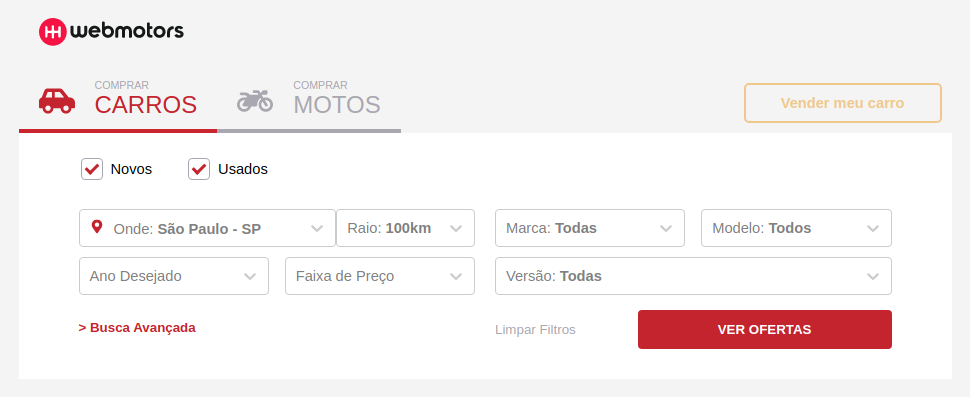

# webmotors-react-test

Repositório criado para armazenar o código do repositório teste de recriação e simulação da página inicial da Webmotors.

Projeto feito em ReactJS, usando TypeScript, [react-select](https://react-select.com/home), [react-icons](https://react-icons.netlify.com/#/), [redux e react-redux](https://redux.js.org/).

## Como usar

Para rodar o projeto em modo de desenvolvimento, basta executar o comando `yarn start` na pasta raiz do projeto e a página inicial se abirá no seu navegador padrão no endereço `http:localhost:3000`, desde que a porta `3000` esteja liberada.

## Licença

MIT.
